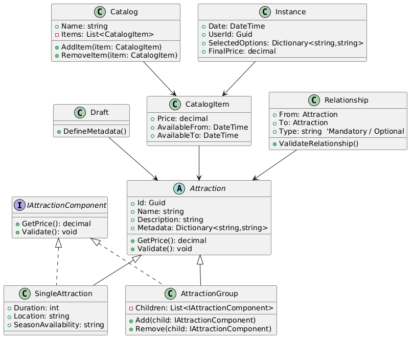

# Projekt biznesowy - Wachowicz, Zawartka, Łyko, Zięba

## 1. Podstawowy archetyp i kompozyt

Attraction – główna klasa abstrakcyjna reprezentująca pojedynczą atrakcję lub grupę atrakcji (wzorzec produkt).

Zawiera Id, Name, Description, Metadata – czyli wszystkie podstawowe cechy, które są wspólne dla każdej atrakcji.

Metody: GetPrice() i Validate() – obliczanie ceny i walidacja reguł biznesowych.

IAttractionComponent – interfejs Kompozytu, który narzuca ten sam kontrakt dla pojedynczych atrakcji i grup.

Dziedziczą po nim SingleAttraction i AttractionGroup.

SingleAttraction – liść kompozytu. Konkretna atrakcja, której nie da się podzielić na mniejsze części.

Posiada np. Duration, Location, SeasonAvailability.

AttractionGroup – kompozyt. Może zawierać listę innych komponentów (Single lub Group).

Metody: Add(child) i Remove(child) – zarządzanie dziećmi w grupie.

## 2. Stany atrakcji

Draft – szkic atrakcji.

Zawiera metodę DefineMetadata() do definiowania niezmiennych cech i wymagań.

Po Draft powstaje Attraction (czyli prawdziwy produkt w systemie).

CatalogItem – pojedynczy element w katalogu.

Odwołuje się do Attraction (może być Single lub Group).

Zawiera cenę (Price) i okres dostępności (AvailableFrom / AvailableTo).

Catalog – lista ofert (czyli lista CatalogItem).

Posiada metodę AddItem() i RemoveItem() do zarządzania ofertą.

Instance – konkretna rezerwacja, powstała z katalogu.

Zawiera: Date (kiedy), UserId (kto), SelectedOptions (wybrane warianty), FinalPrice (cena końcowa).

Odwołuje się do CatalogItem, czyli konkretnej oferty z katalogu.

## 3. Relacje

Relationship – reprezentuje powiązania między atrakcjami.

From i To → wskazują, między którymi atrakcjami zachodzi relacja.

Type = Mandatory / Optional.

ValidateRelationship() – walidacja, czy zależności są poprawne.
